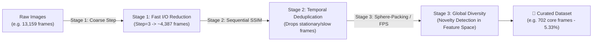

# 🚀 Image Dataset Curator (`image-dataset-curator`)

> **A High-Performance Multi-Stage Image Dataset Deduplication and Diversity Curation Pipeline for Computer Vision & Deep Learning (Object Detection, Classification, Segmentation, Robotics, Visual SLAM & Generative AI).**

[](https://github.com/serene4mr/image-dataset-curator/actions/workflows/ci.yml)
[](https://github.com/serene4mr/image-dataset-curator/releases)
[](https://opensource.org/licenses/MIT)

---

## 📌 Overview & Problem Statement

Collecting image datasets from continuous camera streams, mobile robots, drones, or handheld videos often results in **massive redundancy**:
* Thousands of near-identical frames when the camera is stationary or moving slowly.
* Repetitive scenes when revisiting previously traversed paths or identical viewpoints.
* Ballooning annotation costs, training times, and high risk of model overfitting/data leakage.

**`image-dataset-curator`** solves this with an intelligent **3-Stage Filtering Pipeline**, reducing continuous video datasets by **90–95%** while retaining maximum visual diversity and novelty.



---

## 🔬 How the 3-Stage Pipeline Works

### 1️⃣ Stage 1: Coarse Fixed-Step Subsampling
* **Mechanism:** Subsamples input frames uniformly (default: 1 in every 3 frames).
* **Purpose:** Rapidly slashes disk I/O by 67% in under 0.01s, accelerating downstream stages by 3–5x.

### 2️⃣ Stage 2: Sequential Similarity Filtering
* **Mechanism:** Measures structural divergence between consecutive frames using **Structural Similarity Index (SSIM)** or **Difference Hash (dHash)**.
* **Purpose:** If the camera is paused or moving slowly ($SSIM \ge 0.85$), the duplicate frame is instantly dropped. Keeps only frames that exhibit meaningful perspective shifts.

### 3️⃣ Stage 3: Global Diversity & Representation (Auto Sphere-Packing / FPS)
* **Mechanism:**
  1. Each candidate frame is encoded into a normalized **Feature Embedding Vector** (Spatial Color HSV + Texture Gradient Pyramid, or deep embeddings via DINOv2/ResNet).
  2. **Auto Mode (`--mode auto`):** Employs **Greedy Sphere-Packing / Novelty Dispersion**. A frame is accepted **only if** its maximum Cosine Similarity to all previously accepted frames is below a similarity threshold ($Sim_{\max} < 0.975$). If an angle or scene was already captured earlier, it is pruned.
  3. **Budget Mode (`--mode budget`):** Uses **Farthest Point Sampling (FPS)** in cosine metric space to select the exact user-specified budget ($K$ images or $P\%$).

---

## ⚡ Quick Start: 2 Ways to Run

### Option A: Standalone Prebuilt Executables (No Python Required)
Download the standalone executable directly from [GitHub Releases](https://github.com/serene4mr/image-dataset-curator/releases/latest):
* 🐧 **Linux (x86_64):** `image-dataset-curator-linux-x86_64`
* 🪟 **Windows (x64):** `image-dataset-curator-windows-x86_64.exe`
* 🍎 **macOS (Apple Silicon):** `image-dataset-curator-macos-arm64`

Run directly in terminal or command prompt:
```bash
# Linux / macOS
chmod +x image-dataset-curator-linux-x86_64
./image-dataset-curator-linux-x86_64 -i /path/to/raw_images -o /path/to/curated_images

# Windows
image-dataset-curator-windows-x86_64.exe -i C:\data\raw_images -o C:\data\curated_images
```

👉 **For full OS-specific installation, path setup, and troubleshooting, read the [📖 Standalone Binary User Guide](docs/STANDALONE_GUIDE.md).**

---

### Option B: Run via UV (Fastest for Python Developers)
Install and run in seconds using **[uv](https://github.com/astral-sh/uv)**:

```bash
# Clone the repository
git clone https://github.com/serene4mr/image-dataset-curator.git
cd image-dataset-curator

# Install dependencies
uv sync

# Run the curator CLI
uv run img-curator -i /path/to/raw_images -o /path/to/curated_images --mode auto
```

*(Optional: Enable PyTorch deep models such as DINOv2/ResNet)*:
```bash
uv sync --extra deep
uv run img-curator -i /path/to/raw_images -o /path/to/curated_images --stage3-model dinov2
```

---

## 📖 Usage Examples

### 1. Auto-Adaptive Mode (Recommended)
Automatically determines the optimal dataset size based on true visual variance:
```bash
# Standard auto curation (copies selected images)
uv run img-curator -i /path/to/raw_images -o /path/to/curated_images --mode auto

# Adjust sensitivity presets:
# - 'high'   (~8-12% retained): Captures finer angle/lighting variations.
# - 'medium' (~4-7% retained, default): Optimal balance of coverage vs. compactness.
# - 'low'    (~1-3% retained): Highly aggressive filtering for distinct scenes only.
uv run img-curator -i /path/to/raw_images -o /path/to/curated_images --mode auto --auto-sensitivity high
```

### 2. Budget Mode (Exact Count or Percentage)
```bash
# Retain exactly 5% of raw frames (~650 from 13k images)
uv run img-curator -i /path/to/raw_images -o /path/to/curated_images -p 5

# Retain exactly 800 most diverse frames
uv run img-curator -i /path/to/raw_images -o /path/to/curated_images -k 800
```

### 3. Zero-Disk Overhead with Symlinks
Create symbolic links instead of duplicating image files on disk:
```bash
uv run img-curator -i /path/to/raw_images -o /path/to/curated_images --mode auto --action symlink
```

---

## 📊 Output Directory Structure

The destination directory (`-o /path/to/curated_images`) will contain:

```
curated_images/
├── frame_000000.png           # Filtered image files directly inside output folder
├── frame_000015.png
├── frame_000042.png
├── ...
├── selected_frames.txt        # Plain text list of selected filenames (one per line)
└── filter_report.json         # Comprehensive execution report and reduction metrics
```

#### Example `filter_report.json`:
```json
{
  "total_raw_frames": 13159,
  "mode": "auto",
  "auto_sensitivity": "medium",
  "stages": {
    "stage1": { "step": 3, "retained": 4387, "duration_sec": 0.0 },
    "stage2": { "metric": "ssim", "retained": 4384, "duration_sec": 92.4 },
    "stage3": { "method": "auto_sphere_packing", "retained": 702, "duration_sec": 85.91 }
  },
  "total_time_sec": 178.31,
  "selected_count": 702,
  "reduction_ratio_pct": 94.67,
  "selected_files": ["frame_000000.png", "frame_000006.png", "..."]
}
```

---

## 📊 CLI Parameters Reference

| Parameter | Short | Description | Default |
| :--- | :---: | :--- | :--- |
| `--input-dir` | `-i` | Path to directory containing raw images | *(Required)* |
| `--output-dir` | `-o` | Path to destination output directory | *(Required)* |
| `--mode` | | Curation mode: `auto` or `budget` | `auto` |
| `--auto-sensitivity` | | Sensitivity in auto mode: `high`, `medium`, `low` | `medium` |
| `--target-pct` | `-p` | Target percentage of dataset to retain (e.g. `5` for 5%) | `None` |
| `--target-count` | `-k` | Exact number of images to retain (e.g. `800`) | `None` |
| `--action` | | Export action: `copy`, `symlink`, `list` | `copy` |
| `--extensions` | | Comma-separated image extensions to search for | `png,jpg,jpeg` |
| `--stage1-step` | | Subsampling step size for Stage 1 | `3` |
| `--stage2-metric` | | Temporal similarity metric: `ssim` or `dhash` | `ssim` |
| `--stage2-ssim-thresh` | | SSIM threshold for Stage 2 (drop if similarity > thresh) | `0.85` |
| `--stage3-model` | | Feature model for Stage 3: `auto`, `dinov2`, `spatial_hist` | `auto` |

---

## 🏗 Repository Structure

```
image-dataset-curator/
├── pyproject.toml              # UV project configuration and dependencies
├── uv.lock                     # Deterministic environment lockfile
├── README.md                   # Comprehensive documentation and guide
├── .github/
│   └── workflows/
│       ├── ci.yml              # Multi-OS (Ubuntu, Windows, macOS) automated testing
│       └── release.yml         # Automated standalone binary packaging
├── src/
│   └── image_dataset_curator/
│       ├── __init__.py
│       ├── cli.py              # Rich terminal CLI interface
│       ├── pipeline.py         # Multi-stage pipeline coordinator
│       ├── stages/             # Pipeline filtering stages
│       │   ├── stage1_step.py        # Stage 1: Coarse skip-frame subsampling
│       │   ├── stage2_similarity.py  # Stage 2: Sequential SSIM / dHash
│       │   └── stage3_diversity.py   # Stage 3: Global diversity & Sphere-Packing
│       ├── extractors/         # Feature extraction backbones
│       │   ├── base.py               # Abstract feature extractor interface
│       │   ├── spatial_pyramid.py    # Spatial Color/Edge Histogram (Zero-GPU)
│       │   └── deep_extractor.py     # PyTorch DINOv2 / ResNet backbone
│       └── utils/              # Metrics and I/O utilities
│           ├── io.py                 # Direct folder export & report generation
│           └── metrics.py            # SSIM and dHash computations
└── tests/
    └── test_pipeline.py        # Unit test suite
```

---

## 📄 License

This project is licensed under the [MIT License](LICENSE).
